# *Projeto Final da aluna A80790 para a UC de Sistemas Informação Geográfica*

Visualização de casos de COVID-19 através de gráficos e mapas

Neste notebook estão alguns gráficos relativos aos casos de COVID-19 em alguns países

## Agrupamento dos dados por países

Obtiveram-se alguns gráficos com os casos por países, utilizou-se uma função para apenas contar os países com mais de 100 casos.
__*NOTA*: em alguns gráficos, como os valores são muito elevados, aparece a notação científica.__

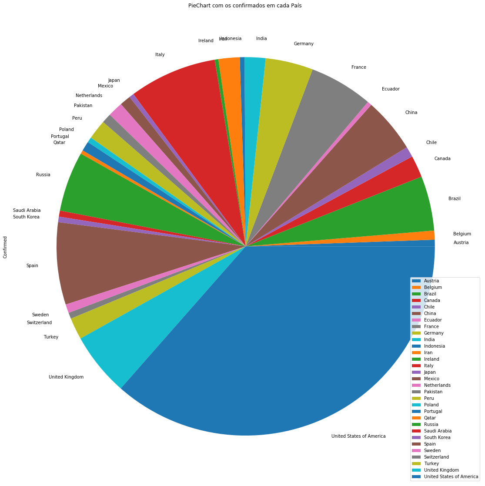<!-- .element height="50%" width="50%" -->

Gráfico com os confirmados e os mortos, de acordo com os países com mais confirmados.

Gráficos com o total de confirmados vs mortos, para tal fez-se a soma de todos os confirmados e mortos por país até a data.

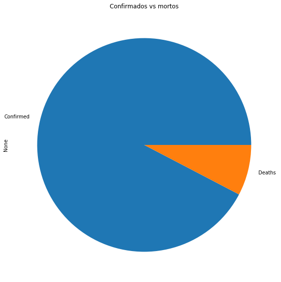

### Casos por categoria

Tendo em conta alguns dados de tempo médio até ser dada a alta a casos graves e críticos, obteve-se um gráfico com o Tempo médio de hospitalização para cada um deles. 

Fez-se um gráfico relativo aos casos de COVID-19 por três categorias, leves, graves e críticos. 

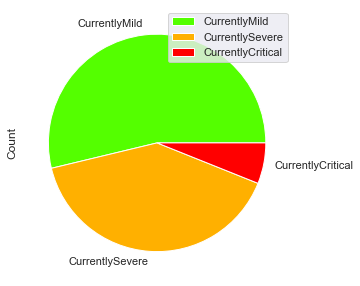

## Mapas mundo

Utilizaram-se os dados atuais de mortos e recuperados nos diferentes países para construir os mapas com a Taxa de Mortalidade no Mundo e com a Taxa de Recuperação no mundo. 

#### Taxa de Mortalidade 

#### Taxa de Recuperação 

## Estatísticas de top 10

Para estas estatísticas de top 10 fizeram-se alterações ao dataset utilizado, incluindo selecionar algumas colunas, agregar os dados, fazer somas e guardar esses dados em novos ficheiros csv. Estes ficheiros podem ser encontrados na pasta Dados.

### Top 10 países 

#### Com mais casos confirmados
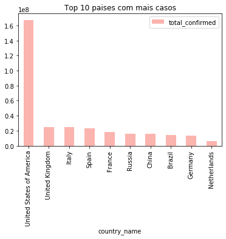

#### Com mais mortos
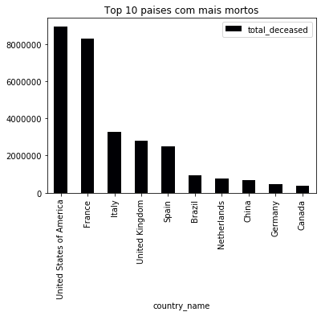

#### Com mais recuperados
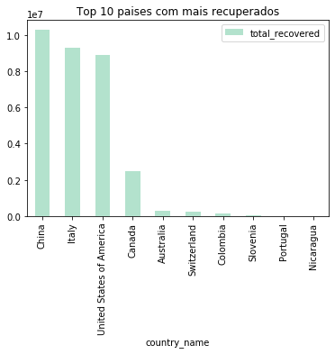

#### Com mais casos hospitalizados
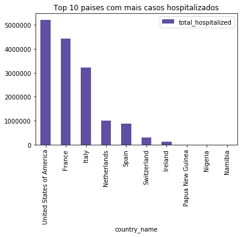

#### Com mais casos nos cuidados intensivos
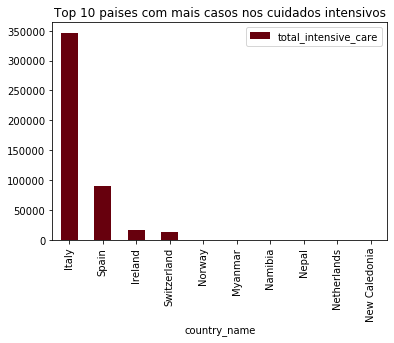

#### Com mais testes
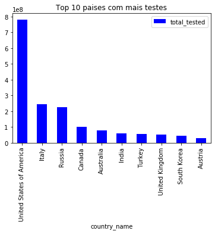

### Top 10 regiões na Austrália

#### Regiões com mais casos confirmados

#### Regiões com mais recuperados

#### Regiões com mais mortos

#### Regiões com mais testes

#### Regiões com mais casos hospitalizados

## Casos em Espanha

Total de confirmados e mortos em Espanha por data.

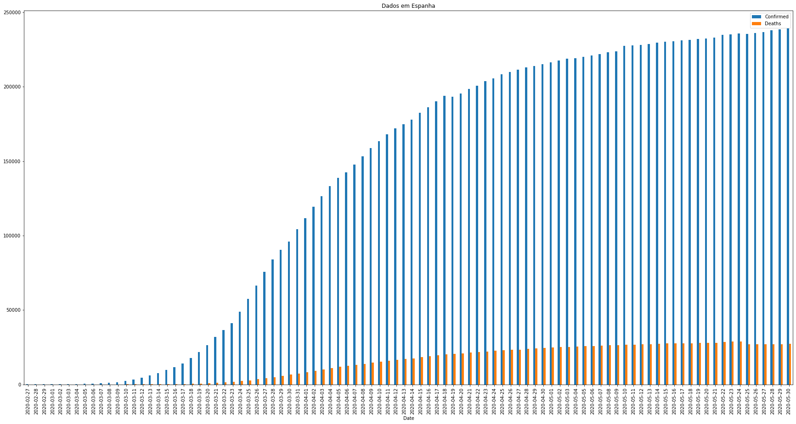

### Casos numa região de Espanha

Gráfico com os confirmados e mortos para as Asturias, uma das sub-regiões de Espanha, até a data mais atual, de notar que os dados para as sub-regiões não são tão atuais como os dados no país todo, ou seja, enquanto que para Espanha no geral se obteve os dados até ao dis 29 de Maio, para a sub-região o mais recente é 21 de maio.

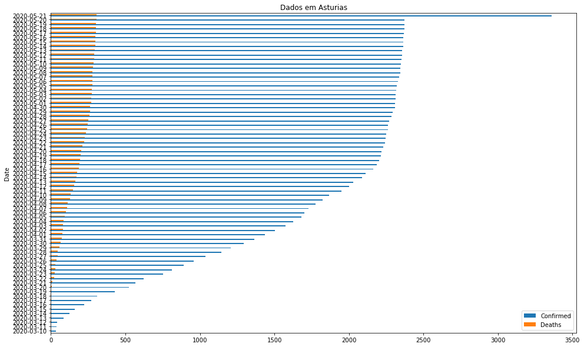

## Casos em Itália

### Total de casos Confirmados e mortos 

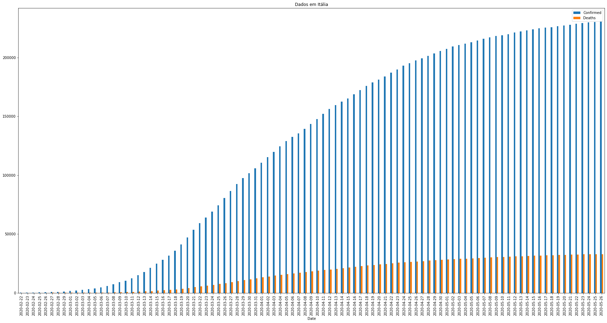

### Heurística - modelagem exponencial

Fez-se uso de uma heurística já existente e a encontrada é do dia 17 de março, portanto,  os gráficos seguintes são baseados nessa data.

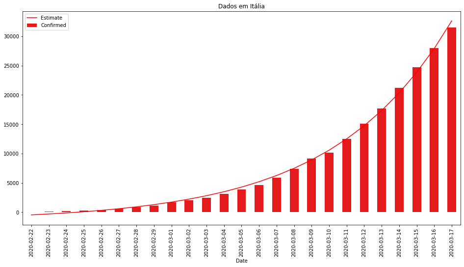

### Estimativa de 3 dias vs dados reais

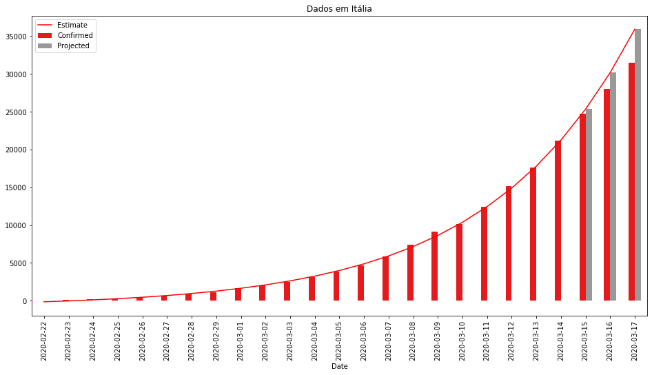

### Estimar 3 dias futuros

## Casos na Corea do Sul

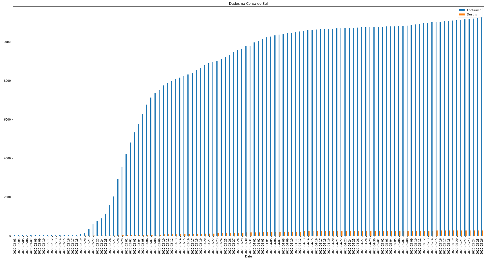

### Heurística - modelagem exponencial

Fez-se uso de uma heurística já existente e a encontrada é do dia 18 de março, portanto,  os gráficos seguintes são baseados nessa data.

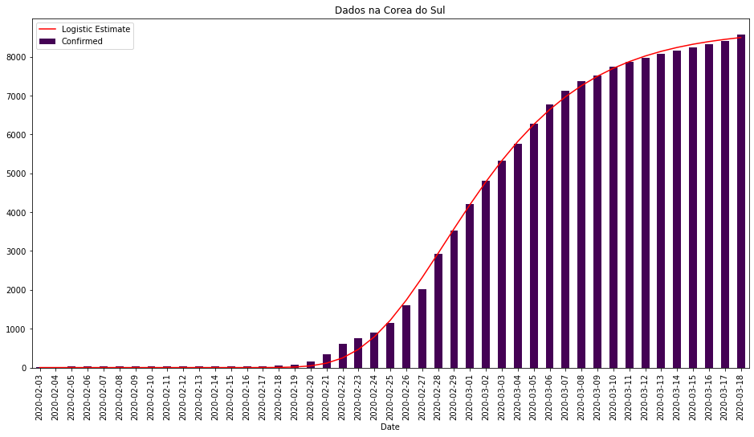

### Estimativa de 3 dias vs dados reais

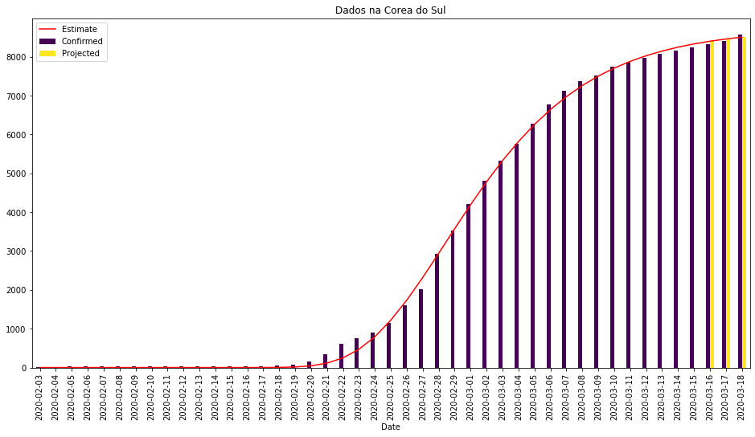

### Estimar 3 dias futuros

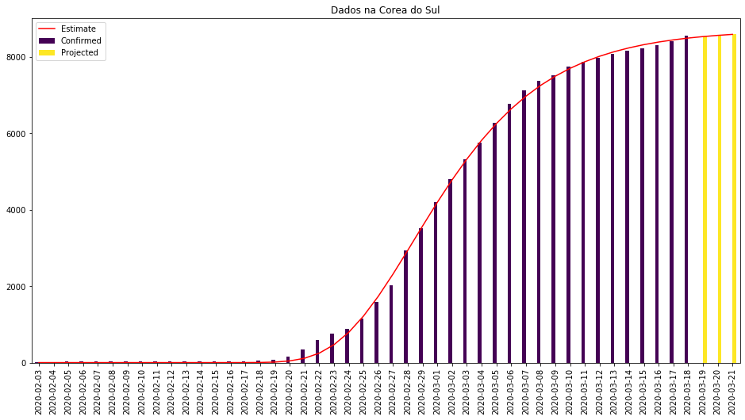

